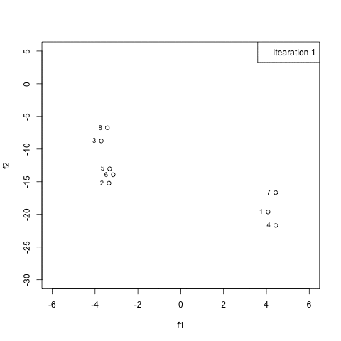

# pymooR

First draft of the NSGA II algorithm as implemented in pythons pymoo. All helper
functions are implemented in `utils.R` where the naming is mostly inherited from 
pymoo. The code is still under construction and may contain many bugs.

Execute `nsgall.R` to let the algorithm run for two randomly initialized 
populations with two arguments (`x1` and `x2`) and two objectives (`f1` and `f2`).
The following exemplary function demonstrates the shortcomings of the
current implementation.

```
  fn <- function(x) {
  
    y <- numeric(2)
    
    y[1] <- x[1] # f1
    y[2] <- 1 + x[2] - x[1]^2 # f2
    
    setNames(y, c("f1","f2"))
  }

```

<p align="center">
  
  <figcaption>This plot shows the evolution of a randomly initialized population where fn has its 
  optimal solution at x1 = x2 = -5; fn = (-5, -29). However, the algorithm finds the 
  wrong solution in the lower right instead of the lower left corner after 20 iterations.</figcaption>
</p>

